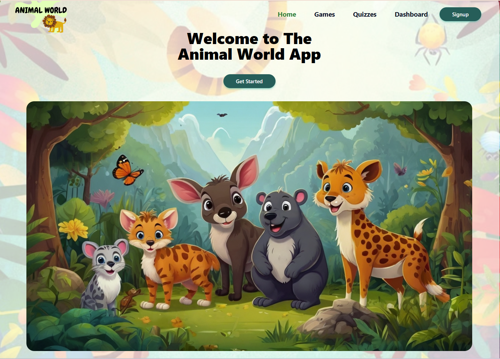

# Animal World - Educational Gaming Platform 🦁🎮

](img.png)


## Table of Contents

- [Live Demo](#live-demo)
- [Description](#description)
- [Features](#features)
- [Technologies Used](#technologies-used)
- [Required Services](#required-services)
- [Installation](#installation)
- [Configuration](#configuration)
- [Usage](#usage)
- [API Documentation](#api-documentation)
- [Testing](#testing)
- [Deployment Checklist](#deployment-checklist)
- [Contributing](#contributing)
- [License](#license)
- [Special Thanks](#special-thanks)
- [Team Members](#team-members)

## Live Demo

🌐 **Live Application
**: [https://deploy-preview-48--v54-tier3-team-36.netlify.app/](https://deploy-preview-48--v54-tier3-team-36.netlify.app/)

## Description

**Animal World** is a full-stack educational gaming platform designed for children to learn about animals through
interactive games and quizzes. Built with the MERN stack, it provides an engaging and fun learning experience with
multiple game modes, user authentication, progress tracking, and a responsive design that works seamlessly across all
devices.

The platform combines entertainment with education, allowing children of all age groups to explore the animal kingdom
through various interactive activities including puzzles, sound recognition games, feeding simulations, and educational
flashcards.

## Features

### Educational Games

- **Animal Flashcard Game** - Interactive flashcards for learning animal facts with visual learning aids
- **Sliding Animal Puzzle** - Classic sliding puzzle with multiple difficulty levels and timer functionality
- **Guess Animal Sound Game** - Audio-based learning with 19 different authentic animal sounds
- **Feed the Animal Game** - Drag-and-drop gameplay teaching about animal diets with scoring system

### User Management

- Secure registration and login with JWT authentication
- Age group selection for age-appropriate content
- Personal user profiles with avatars
- Session management with secure token storage

### Dashboard & Analytics

- Personal dashboard with comprehensive game statistics
- High scores and win tracking across all games
- Detailed game history with performance metrics
- Achievement system infrastructure for future badges

### Animal Quiz System

- Multi-level quiz structure with varying difficulty
- Progress tracking across sessions
- Score persistence and improvement tracking
- Visual feedback for correct/incorrect answers

### Modern UI/UX

- Responsive design optimized for all devices
- Tailwind CSS for modern, consistent styling
- Accessible component design with Radix UI
- Interactive animations and transitions
- Dark mode support (coming soon)

## Technologies Used

### Frontend

- **React 18.2** - Core UI framework
- **React Router v7** - Client-side routing
- **Vite** - Lightning-fast build tool
- **Tailwind CSS 3.4** - Utility-first CSS framework
- **React Hook Form + Zod** - Form management and validation
- **Axios** - HTTP client for API communication
- **Radix UI** - Accessible component primitives
- **React Toastify** - Beautiful notifications
- **Lucide React** - Modern icon library
- **Jest & React Testing Library** - Testing with 60%+ coverage

### Backend

- **Node.js & Express 5.1** - Server framework
- **MongoDB with Mongoose 8.13** - Database and ODM
- **JWT** - Secure authentication tokens
- **Bcrypt** - Industry-standard password hashing
- **CORS** - Cross-origin resource sharing
- **Dotenv** - Environment configuration

## Required Services

- **Node.js** (v18.0.0 or higher)
- **MongoDB** (v7.0 or higher)
- **npm** or **yarn** package manager
- **Git** for version control

## Installation

1. **Clone the repository**

```bash
git clone https://github.com/chingu-voyages/V54-tier3-team-36.git
cd V54-tier3-team-36
```

2. **Install backend dependencies**

```bash
cd server
npm install
```

3. **Install frontend dependencies**

```bash
cd ../client
npm install
```

## Configuration

1. **Backend Configuration**
   Create a `.env` file in the `/server` directory:

```env
PORT=5001
MONGODB_URI=mongodb://localhost:27017/animal-world
JWT_SECRET=your-super-secret-jwt-key-change-this-in-production
NODE_ENV=development
```

2. **Frontend Configuration**
   The frontend automatically switches between development and production APIs:

- Development: `http://localhost:5001`
- Production: `https://v54-tier3-team-36.onrender.com`

## Usage

### Development Mode

1. **Start the backend server**

```bash
cd server
npm run dev
```

2. **Start the frontend development server**

```bash
cd client
npm run dev
```

3. **Access the application**
   Open your browser and navigate to `http://localhost:5173`

## API Documentation

### Authentication Endpoints (`/api/auth`)

- `POST /api/auth/signup` - Register a new user
    - Body: `{ name, email, password, age }`
    - Returns: User object and JWT token
- `POST /api/auth/login` - Authenticate user
    - Body: `{ email, password }`
    - Returns: User object and JWT token
- `GET /api/auth/verifytoken` - Validate JWT token
    - Headers: `Authorization: Bearer <token>`
    - Returns: Token validity status

### Dashboard Endpoints (`/api/dashboard`)

- `GET /api/dashboard/:id` - Get user dashboard data
    - Params: User ID
    - Returns: User statistics, game history, badges

### Game Endpoints (`/api/games`)

- `POST /api/games/save` - Save game session (Feed the Animal)
    - Body: Game session data
    - Returns: Saved session ID
- `GET /api/games/history` - Get user's game history
    - Headers: `Authorization: Bearer <token>`
    - Returns: Array of game sessions with statistics
- `GET /api/games/result/:id` - Get game results by user ID
    - Params: User ID
    - Returns: Detailed game statistics
- `POST /api/games/result` - Update game statistics
    - Body: `{ userId, gameName, score, won }`
    - Returns: Updated statistics

## Testing

### Test Coverage


Our comprehensive test suite ensures code quality and reliability:

- **Unit Tests**: All UI components (Button, Form, Input, Toast, etc.)
- **Integration Tests**: Critical user flows and authentication
- **Component Tests**: Game components and interactive elements
- **Mock Testing**: External dependencies and API calls

### Running Tests

```bash
# Run tests in watch mode
cd client
npm test

# Generate coverage report
npm run test:coverage

# View HTML coverage report in browser
npm run test:coverage:view
```

### Test Configuration

- **Framework**: Jest 29.7 with React Testing Library
- **Coverage Tool**: Istanbul
- **Coverage Threshold**: 60%+ (and growing!)
- **Test Files**: `*.test.js`, `*.spec.js`

### Building for Production

```bash
# Build frontend
cd client
npm run build

# Preview production build locally
npm run preview
```

## Deployment Checklist

### Pre-deployment

- [ ] Update environment variables for production
- [ ] Set `NODE_ENV=production`
- [ ] Update JWT_SECRET with a secure key
- [ ] Configure MongoDB Atlas or production database
- [ ] Update CORS settings for production domain
- [ ] Run full test suite
- [ ] Build frontend with production API URL

### Deployment Steps

1. Deploy backend to hosting service (e.g., Render, Heroku)
2. Configure environment variables on hosting platform
3. Deploy frontend to static hosting (e.g., Netlify, Vercel)
4. Update DNS settings if using custom domain
5. Test all features in production environment
6. Monitor application logs and performance

### Post-deployment

- [ ] Verify all games are functioning
- [ ] Test user registration and login
- [ ] Check database connections
- [ ] Monitor error logs
- [ ] Set up backup strategy

## Contributing

We welcome contributions to Animal World! Please follow these steps:

1. Fork the repository
2. Create a feature branch (`git checkout -b feature/AmazingFeature`)
3. Commit your changes (`git commit -m 'Add some AmazingFeature'`)
4. Push to the branch (`git push origin feature/AmazingFeature`)
5. Open a Pull Request

### Development Guidelines

- Follow existing code style and conventions
- Write tests for new features
- Update documentation as needed
- Ensure all tests pass before submitting PR
- Include clear commit messages

## License

This project is licensed under the MIT License - see the [LICENSE](LICENSE) file for details.

## Special Thanks

- **Chingu** - For organizing Voyage 54 and providing this amazing opportunity
- **All Contributors** - For their dedication and hard work
- **Open Source Community** - For the amazing tools and libraries
- **Beta Testers** - For valuable feedback and bug reports

## Team Members

This project was developed by an amazing team of 10 developers as part of Chingu Voyage 54:

- **Valeriy Lysenko**: [GitHub](https://github.com/Valeriusdev) / [LinkedIn](https://linkedin.com/in/valeriylysenko)
- **Rigo L**: [GitHub](https://github.com/r1g023) / [LinkedIn](https://www.linkedin.com/in/rigo0101/)
- **Julie Cheng**: [GitHub](https://github.com/jucheng925) / [LinkedIn](https://www.linkedin.com/in/juliecheng925/)
- **Jorge Alvarado**: [GitHub](https://github.com/alvarado08) / [LinkedIn](https://linkedin.com/in/jorgep-alvarado)
- **Rika Miyata**: [GitHub](https://github.com/Tayrika) / [LinkedIn](https://www.linkedin.com/in/rika-miyata-4bab99243/)
- **Aigul Yermagambetova**: [GitHub](https://github.com/aigul-ermak) / [LinkedIn](https://www.linkedin.com/in/aigul-ermak/)
- **Wataru Okada**: [GitHub](https://github.com/WataTechJP) / [LinkedIn](https://www.linkedin.com/in/wataru-okada-509319334/)
- **Adelola Abioye**: [GitHub](https://github.com/Adel-abio) / [LinkedIn](https://www.linkedin.com/in/adelola-abioye/)
- **Ekaterina Kushnir**: [GitHub](https://github.com/katiaku) / [LinkedIn](https://www.linkedin.com/in/ekaterina-kushnir-mikhaylova/)
- **Deepali Sangole**: [GitHub](https://github.com/ss-deep) / [LinkedIn](https://www.linkedin.com/in/deepali-sangole-49b0841b/)

---

<div align="center">
  Made with ❤️ by Team 40 - Chingu Voyage 56
</div>